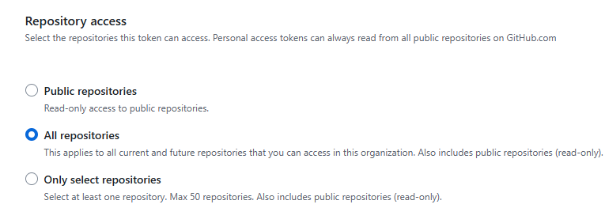
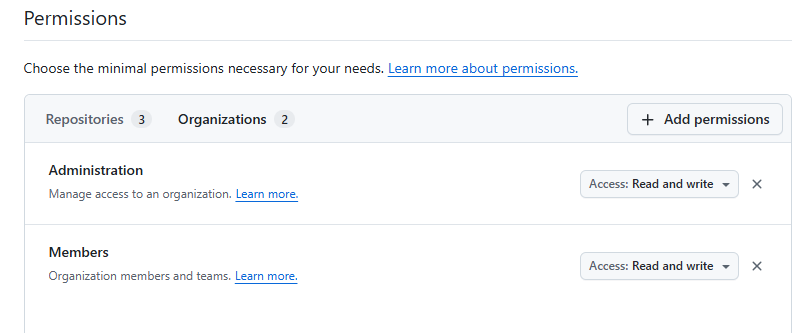
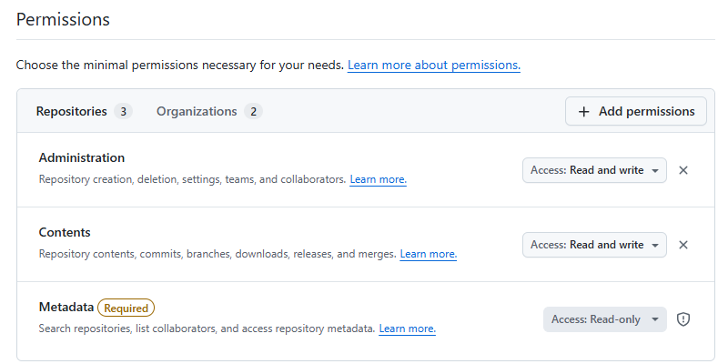

# GitHub Utils

A collection of Python scripts for managing GitHub organizations, teams, repositories, and memberships via the GitHub REST API.

## Overview

These scripts provide bulk operations for:
- **Retrieving** organization team, repository, and membership data to CSV
- **Creating** organizations teams, and repositories
- **Assigning** users to organizations, teams, and repositories

All scripts require a GitHub Personal Access Token (PAT) and support both token argument and `GITHUB_TOKEN` environment variable.

## Scripts by Category

### Retrieval (GET)

| Script | Purpose |
|--------|---------|
| `get_org_teams.py` | List all teams in an organization |
| `get_org_members.py` | List all members in an organization |
| `get_org_repos.py` | List all repositories in an organization |
| `get_team_repos.py` | List repositories accessible to each team and team permissions |
| `get_team_members.py` | List members of each team |

### Creation (CREATE)

| Script | Purpose |
|--------|---------|
| `create_teams.py` | Create teams in bulk from CSV |
| `create_repos.py` | Create repositories in bulk from CSV |

### Assignment (ASSIGN)

| Script | Purpose |
|--------|---------|
| `assign_org_users.py` | Assign users to organizations |
| `assign_team_members.py` | Assign users to teams in bulk |
| `assign_team_repos.py` | Assign repositories to teams in bulk |

## Quick Start

### Prerequisites

- Python 3.7+
- GitHub Personal Access Token (PAT)
  - Fine-grained PAT with appropriate scopes, or
  - Classic PAT with `admin:org` and `repo` scopes

### Set GitHub Token

Option 1: Pass via command line
```powershell
python src/get_org_teams.py --org-name my-org --output-csv teams_out.csv --token <YOUR_GITHUB_TOKEN>
```

Option 2: Set environment variable
```powershell
$env:GITHUB_TOKEN="<YOUR_GITHUB_TOKEN>"
python src/get_org_teams.py --org-name my-org --output-csv teams_out.csv
```

## Documentation

Detailed documentation for each script is available in the `docs/` directory:
- [docs/get_org_teams.md](docs/get_org_teams.md)
- [docs/get_org_members.md](docs/get_org_members.md)
- [docs/get_org_repos.md](docs/get_org_repos.md)
- [docs/get_team_repos.md](docs/get_team_repos.md)
- [docs/get_team_members.md](docs/get_team_members.md)
- [docs/create_teams.md](docs/create_teams.md)
- [docs/create_repos.md](docs/create_repos.md)
- [docs/assign_org_users.md](docs/assign_org_users.md)
- [docs/assign_team_members.md](docs/assign_team_members.md)
- [docs/assign_team_repos.md](docs/assign_team_repos.md)

Reference guide:
- [docs/github-team-structure-guide.md](docs/github-team-structure-guide.md) - Recommended nested team structure for regular members and TechLeads, including role and permission design guidance.

## Shared Utilities

The following functions are shared across scripts:
- `list_org_teams()` — paginated retrieval of all teams in an organization (in `get_org_teams.py`)
- `get_team_by_slug()` — direct lookup of a single team by slug (in `get_org_teams.py`)

These are imported by `get_team_repos.py` and `get_team_members.py` to reduce code duplication.

## Error Handling

All scripts include:
- Validation of required arguments
- HTTP error handling with descriptive messages
- Per-item success/failure tracking
- Console summary of results

## Token Scope Requirements

Review the documentation for each script to see specific PAT scope requirements:
- **Retrieval scripts** generally require `read:org` or organization read permissions
- **Creation scripts** require `admin:org` or team/repository administration permissions
- **Assignment scripts** require `admin:org` or organization membership administration permissions

### Fine-Grained Token Permission Reference





